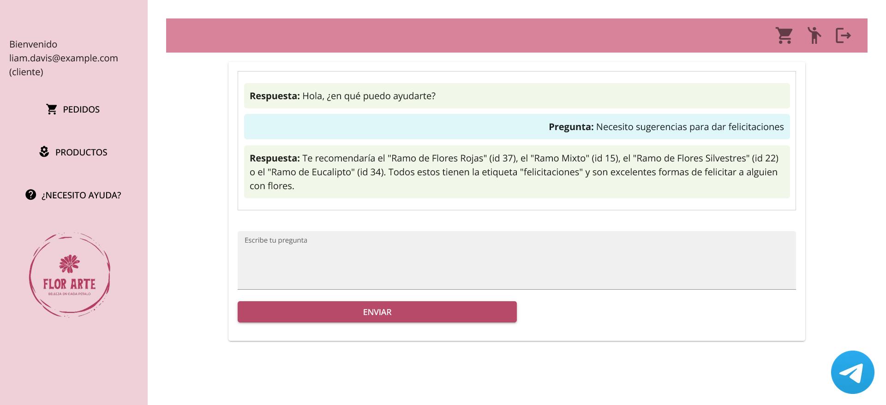

# florarte

## Introduction

 FlorArte is @fernanda-una's and @fmadrian's class project made for the class "Web-based application development (EIF509)".

This is a web application for a flower shop that allows administrator users to manage a product (flowers) catalog, categories, tags, and orders. It also allows customers to browser through this catalog and place orders. 

Through the web client, both customers and administrators have access to all the application features. On the other hand, the bot only lets clients authenticate themselves, see their information, get suggestions about products, place orders, and search previous orders they made.

## What is it made with?

### Backend

The API used to manage the application's information was made with Spring Boot, using Spring Security to implement JWT authorization. It uses a PostgreSQL database to store the data. And finally, it uses ChatGPT through OpenAI's API to help to place orders and give customer suggestions about products they can buy based on the products they are looking for.

[FlorArte - Backend](https://github.com/una-eif509-desarrolloweb-24G01/backend-tango)

### Frontend

The web client was made with Next.js as framework, Zustand for state's management, NextAuth.js to handle the authentication, MUI as component library and Tailwind CSS as CSS framework.

[FlorArte - Frontend](https://github.com/una-eif509-desarrolloweb-24G01/frontend-tango)

### Telegram bot

The Telegram bot was made with Python, python-telegram-bot, and MongoDB which helps to handle some of the user's information. The information stored in the database helps to determine if users are authenticated, and what they are trying to order.

[FlorArte - Bot](https://github.com/fmadrian/bot-tango)

## Features

### Administrator

- Manage products.
- Manage categories.
- Manage tags.
- Manage orders.
- Manage users.

### Clients

- Browse the product catalog.
- Place and search orders.
- Ask an AI assistant about product suggestions based on tags or categories, and placing orders.

## How to run it?
### Backend

#### Requirements

Before running the backend, you **must have** done the following: 
1. Clone the [backend](https://github.com/una-eif509-desarrolloweb-24G01/backend-tango) repository.
2. Create the [PostgreSQL](https://www.postgresql.org/) database.

The following is **optional**, but without it, you won't be able to use the AI assistant functionality:  
1. Have an [OpenAI API](https://platform.openai.com/docs/overview) key.

#### Local deployment

1. Switch to the [main](https://github.com/una-eif509-desarrolloweb-24G01/backend-tango) branch
2. Using [IntelliJ](https://www.jetbrains.com/idea/download), run the backend.

#### Remote deployment using Heroku
1. Switch to [heroku](https://github.com/una-eif509-desarrolloweb-24G01/backend-tango/tree/heroku) branch 
2. Follow this [guide](https://devcenter.heroku.com/articles/deploying-spring-boot-apps-to-heroku).

### Frontend

#### Requirements

Before running the backend, you **must have** the following requirements: 
1. Clone the [frontend](https://github.com/una-eif509-desarrolloweb-24G01/frontend-tango) repository.
#### Local deployment
1. Switch to the [main](https://github.com/una-eif509-desarrolloweb-24G01/frontend-tango/) branch.
2. Create an file **named .env.local** and replace the values on the following variables:
```
NEXT_PUBLIC_API=<tango_api_url>
NEXTAUTH_SECRET=<nextauth_secret>
NEXTAUTH_URL_INTERNAL=http://127.0.0.1:3000
NEXTAUTH_URL=<nextauth_app_url>
```
3. Run the following command:
```
npm run dev
```
#### Remote deployment using Heroku
1. Switch to the [heroku](https://github.com/una-eif509-desarrolloweb-24G01/frontend-tango/tree/heroku) branch.
2. Follow this [guide](https://mariestarck.com/deploy-your-next-js-app-to-heroku-in-5-minutes/).
3. **Take every variable defined in .env and add it as an environment variable in Heroku**.

### Telegram bot
Before running the bot, you **must have** the following requirements: 
1. Clone the [bot](https://github.com/fmadrian/bot-tango) repository.
2. Create a MongoDB database **named** **==sessions==**.
3. [Create a Telegram Bot and obtain a token](https://core.telegram.org/bots/tutorial).
4. Download and run ngrok **using the port 8000**.

#### Local deployment
1. Switch to the [main](https://github.com/una-eif509-desarrolloweb-24G01/frontend-tango/) branch.

2. Run the following command:
```
uvicorn main:app --env-file .env
```
3. Create an .env file and add the following variables:
```
UVICORN_TELEGRAM_BOT_TOKEN=<telegram_token>

UVICORN_WEBHOOK_HOST=<ngrok_host>

UVICORN_MONGODB_CONNECTION_STRING=<mongodb_connection_string>

UVICORN_API_URL=<tango_api_url>
```
#### Remote deployment using Heroku
1. Switch to [heroku](https://github.com/fmadrian/bot-tango/tree/heroku) branch.
2. Deploy this branch on [Heroku](https://www.heroku.com/python). 
3. **Take every variable defined in .env and add it as an environment variable in Heroku**.

## Screenshots

### Web client
Search a product.

Managing orders.

Using the AI assistant.

Visualizing a product.


### Bot
Getting a recommendation using the bot.

Placing an order using the bot.

Visualizing order placed using bot and AI assistant.

